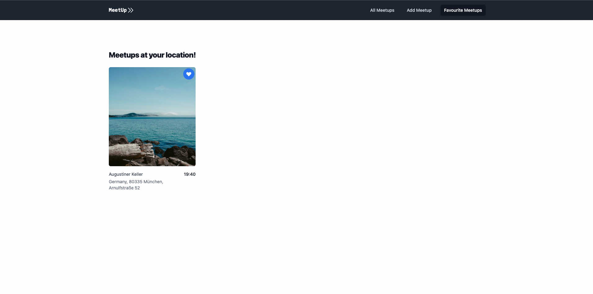

# Meetup React Application

This project is a simplistic meetup application that resulted from my efforts to learn Web Development. It uses React as the Frontend Framework and MongoDB Realm as the Backend. 

### App Features
- *Meetup Page* containing all existing Meetups in the MongoDB database

- *Favourites Page* containing the Meetups that the User liked.

- *Add Meetups page* where the User can add new Meetups, which are after submission, stored in the Database using Mongo Realm functions.  

- *Fully responsive* design implemented using TailwindCSS.
    

    
    
    

### Usage
Neccesary steps to get the application up and running on your local Machine

- *Backend*
    - Set up MongoDB Atlas project and database
    - Activate MongoDB Realm for your project
    - Allow users to sign in anonymously
    - Create MongoDB Realm function that handles Meetup Submission called "insertMeetup"
    - Create MongoDB Realm function that returns all existing Meetups called "getAllMeetups"
    - Copy the AppID of your project into `App.js`
- *Frontend*
    - Clone Repository
    - Install dependencies using `npm install`
    - Run App in development mode  `npm start`
    - Open [http://localhost:3000](http://localhost:3000) to view it in your browser.